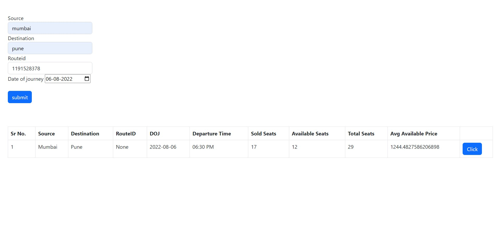
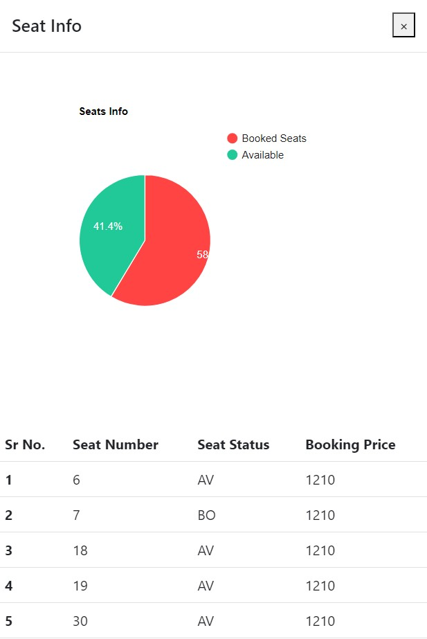

# ScrapingBusSite
## Abhibhus Website Scraper with Scrapy and Django

This project is a web scraping and data visualization application that extracts information from the Abhibhus website using the Scrapy framework, stores the scraped data in a MySQL database, and displays it on a simple Django web page using Bootstrap for styling.

## Table of Contents

- [Features](#features)
- [Installation](#installation)
- [Usage](#usage)
- [Technologies](#technologies)


## Features

- **Web Scraping:** Utilizes the Scrapy framework to efficiently scrape data from the Abhibhus website.
- **Data Storage:** Stores the scraped data in a MySQL database for easy retrieval and analysis.
- **Web Display:** Presents the scraped data on a user-friendly web page created with Django.
- **Bootstrap Styling:** Enhances the appearance of the web page using Bootstrap's responsive design components.

## Installation

1. **Clone the Repository:** Start by cloning this repository to your local machine using the following command:

   ```
   git clone https://github.com/Tejas-Samel/ScrapingBusSite.git
   ```

2. **Create Virtual Environment:** Navigate to the project directory and create a virtual environment to isolate project dependencies:

   ```
   python3 -m venv venv
   ```

3. **Activate Virtual Environment:** Activate the virtual environment:

   - On macOS and Linux:

     ```
     source venv/bin/activate
     ```

   - On Windows:

     ```
     venv\Scripts\activate
     ```

4. **Install Dependencies:** Install the required dependencies using pip:

   ```
   pip install -r requirements.txt
   ```

5. **Database Setup:** Create a MySQL database and update the database configuration in `settings.py`:

   ```python
   DATABASES = {
       'default': {
           'ENGINE': 'django.db.backends.mysql',
           'NAME': 'your_database_name',
           'USER': 'your_database_user',
           'PASSWORD': 'your_database_password',
           'HOST': 'localhost',
           'PORT': '3306',
       }
   }
   ```

6. **Run Migrations:** Apply the initial database migrations:

   ```
   python manage.py migrate
   ```

## Usage

1. **Scrape Data:** Navigate to the `scrapy_project` directory and run the Scrapy spider to scrape data:

   ```
   cd scrapy_project
   scrapy crawl abhi_spider
   ```

2. **Run Django Server:** Go back to the main project directory and start the Django development server:

   ```
   python manage.py runserver
   ```

3. **Access the Webpage:** Open your web browser and navigate to `http://127.0.0.1:8000` to view the scraped data displayed using Django and Bootstrap.

## Technologies

- Scrapy
- Django
- MySQL
- Bootstrap

### Django Screenshots
 

 
---
